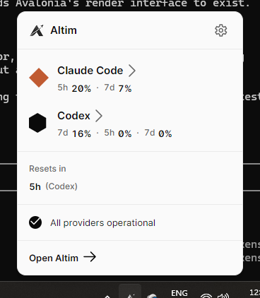

<div align="center">
  <picture>
    <source media="(prefers-color-scheme: dark)" srcset="assets/brand/altim-logo-white.png">
    
  </picture>

  **AI usage, at a glance.**

  [github.com/mpge/altim](https://github.com/mpge/altim)
</div>

---

Altim is a lightweight, local-first desktop monitor for AI coding agent usage. It sits in
your system tray (Windows), menu bar (macOS) or status area (Linux) and answers one
question: **what are my AI coding tools consuming right now?**

<div align="center">
  <picture>
    <source media="(prefers-color-scheme: dark)" srcset="docs/screenshots/popup-dark.png">
    
  </picture>
</div>

> **Status: pre-release.** It builds and passes its tests on Windows, Ubuntu and macOS, and runs
> daily on Windows. Nobody has yet run it on a Mac or a Linux desktop, so the tray icon,
> notifications and start-at-login are unverified there.

## Download

<div align="center">

[](https://github.com/mpge/altim/releases/latest/download/Altim-win-Setup.exe)
[](https://github.com/mpge/altim/releases)
[](https://github.com/mpge/altim/releases)
[](https://github.com/mpge/altim/releases)
[](https://github.com/mpge/altim/releases)

</div>

Nothing is signed with a paid certificate yet, so Windows shows a SmartScreen warning and macOS
needs a right-click **Open** the first time. Every release carries a `SHA256SUMS.txt`.
[INSTALL.md](docs/INSTALL.md) has the per-platform steps, the supported versions, and what is
not built yet.

**Altim lives in the tray**, not in a window. The first launch opens the dashboard once so you
can find it; after that it starts quietly.

## What it shows

- Session and weekly usage against each provider's limits
- Time until the next reset
- Token counts where a provider exposes them
- Whether an agent is working right now, and when it was last active
- Local usage history over 24 hours, 7 days and 30 days
- A year of daily usage as a calendar map, one square per day per provider —
  [how the map is built](docs/USAGE-MAP.md)

## Providers

| Provider | Status |
|---|---|
| Claude / Claude Code | in development |
| OpenAI Codex | in development |
| Google Gemini CLI | in development — token history only |
| Cursor, GitHub Copilot | planned |

Altim never invents numbers. Every metric is traced to a documented local source in
[PROVIDERS.md](PROVIDERS.md), and anything that cannot be read reliably is shown as unavailable
rather than estimated. Gemini CLI is the clearest case: it keeps its real remaining quota only in
the memory of a running process, so Altim reports its tokens and no percentage at all.

## Privacy

Local-first by default. Altim reads usage metadata only, stores it in a local SQLite database,
and never transmits prompts, source code, repository contents, conversation contents, commands or
filenames anywhere. See [PRIVACY.md](PRIVACY.md).

## Performance

Measured on Windows 11, shipping build, with an agent working throughout.

| | Budget | Measured |
|---|---|---|
| Cold start to tray icon | < 800ms | **229ms** |
| Popup open, already warm | < 100ms | **8.4ms** |
| CPU, Altim and its children, idle | < 5% of one core | **3.1%** |
| Idle private working set | < 55MB | **42MB** |
| Database | < 5MB/year | **~4.4MB** |

[PERFORMANCE.md](docs/PERFORMANCE.md) has the full table, what each number excludes, and how to
measure it yourself.

## Building

Requires the **.NET 10 SDK** and nothing else.

```bash
dotnet build Altim.sln -c Release      # warnings are errors
dotnet test Altim.sln -c Release
dotnet run --project src/Altim.App
```

CI compiles and tests on Windows, Linux and macOS. See [DEVELOPING.md](docs/DEVELOPING.md) for
the repository layout and how to add a provider.

## Documentation

| | |
|---|---|
| [INSTALL.md](docs/INSTALL.md) | downloads, per-platform steps, packaging state |
| [PROVIDERS.md](PROVIDERS.md) | every metric and the file it is read from |
| [ARCHITECTURE.md](ARCHITECTURE.md) | how the pieces fit, and where the memory goes |
| [PRIVACY.md](PRIVACY.md) | what is read, what is stored, what never leaves |
| [USAGE-MAP.md](docs/USAGE-MAP.md) | how the daily map is built and what a square means |
| [PERFORMANCE.md](docs/PERFORMANCE.md) | the measured numbers and how to reproduce them |
| [DEVELOPING.md](docs/DEVELOPING.md) | build, layout, adding a provider |
| [DESIGN.md](docs/DESIGN.md) | the design system every view implements |

## License

MIT — see [LICENSE](LICENSE).

## Trademarks

Altim is an independent open-source project, not affiliated with or endorsed by Anthropic, OpenAI
or Google. Claude and Claude Code are trademarks of Anthropic; OpenAI and Codex are trademarks of
OpenAI; Google and Gemini are trademarks of Google LLC. Their names and marks appear here only to
identify which of your own tools a figure belongs to.

The MIT licence covers Altim's code and grants no rights in anyone's trademarks. See
[TRADEMARKS](TRADEMARKS.md) before reusing the provider marks in a fork.

## Support

[](https://buymeacoffee.com/mpge)
