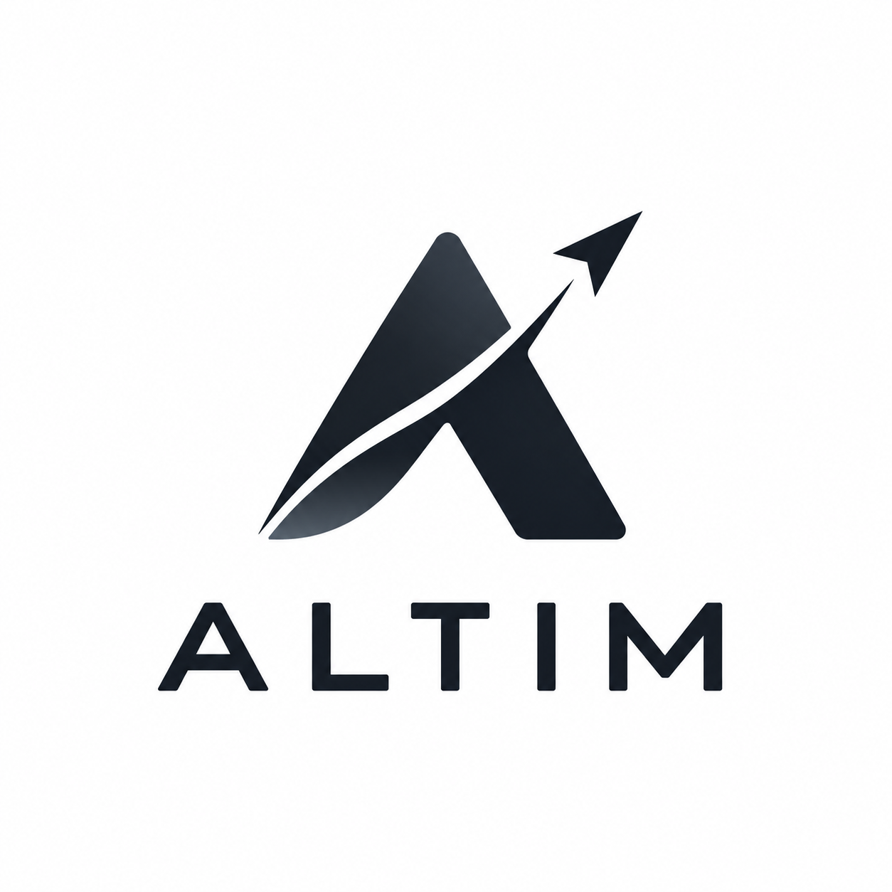

<div align="center">
  

  **AI usage, at a glance.**

  [altim.dev](https://altim.dev)
</div>

---

Altim is a lightweight, local-first desktop monitor for AI coding agent usage. It sits in
your system tray (Windows), menu bar (macOS) or status area (Linux) and answers one
question: **what are my AI coding tools consuming right now?**

> **Status: early development.** The architecture and provider data sources are being
> established first — see [ARCHITECTURE.md](ARCHITECTURE.md) and [PROVIDERS.md](PROVIDERS.md).

## What it shows

- Session and weekly usage against each provider's limits
- Time until the next reset
- Token counts where a provider exposes them
- Whether an agent is working right now, and when it was last active
- Local usage history over 24 hours, 7 days and 30 days

## Providers

| Provider | Status |
|---|---|
| Claude / Claude Code | in development |
| OpenAI Codex | in development |
| Gemini CLI, Cursor, GitHub Copilot | planned |

Altim never invents numbers. Every metric is traced to a documented local source in
[PROVIDERS.md](PROVIDERS.md), and anything that cannot be read reliably is shown as
unavailable rather than estimated.

## Platforms

Windows, macOS and Linux, from one Avalonia UI codebase with native platform services
for tray/menu-bar behaviour, notifications, autostart and power events.

## Privacy

Local-first by default. Altim reads usage metadata only, stores it in a local SQLite
database, and never transmits prompts, source code, repository contents, conversation
contents, commands or filenames anywhere. See [PRIVACY.md](PRIVACY.md).

## Building

Requires the **.NET 10 SDK**. Nothing else — the UI, database and platform integrations come
from NuGet packages pinned in `Directory.Packages.props`.

```bash
dotnet build Altim.sln -c Release      # warnings are errors
dotnet test Altim.sln -c Release
dotnet run --project src/Altim.App
```

## Repository layout

| Path | What lives there |
|---|---|
| `src/Altim.Core` | models, interfaces, usage math, reset arithmetic, the monitoring scheduler, notification thresholds. Depends on nothing but the BCL |
| `src/Altim.Providers` | shared provider plumbing: tail readers, incremental scanning, process detection, CLI invocation |
| `src/Altim.Providers.Claude`, `.Codex` | one project per provider |
| `src/Altim.Storage` | SQLite: migrations, usage history, retention, settings |
| `src/Altim.UI` | Avalonia views, view models, design system, custom controls |
| `src/Altim.Platform.Windows`, `.MacOS`, `.Linux` | native tray, notifications, autostart, power events |
| `src/Altim.App` | composition root |
| `docs/DESIGN.md` | the design system every view implements |

Dependencies run one way: `App → UI → Core`, `App → Platform.* → Core`,
`App → Providers.* → Providers → Core`, `Storage → Core`. Nothing depends on `App`, which is what
keeps the logic testable without a UI.

## Adding a provider

1. Create `src/Altim.Providers.<Name>` and implement `IUsageProvider`.
2. Report only what the provider genuinely exposes. A metric you cannot read is `null`, never `0`
   and never an estimate. Classify limit windows by their length, not by the order a provider
   happens to return them in.
3. Document every field's source in [PROVIDERS.md](PROVIDERS.md), graded documented, best-effort or
   unavailable, and only parse numeric and timestamp fields out of provider files.
4. Register it in the composition root.

No UI work is required: views render whatever metrics a provider reports.

## Platform behaviour

| | Windows | macOS | Linux |
|---|---|---|---|
| Presence | system tray, own `Shell_NotifyIcon` host | menu bar, `NSStatusItem` | StatusNotifierItem |
| Panel anchor | exact icon rectangle, else cursor, else screen corner | status item frame | screen corner (the protocol carries no geometry) |
| Notifications | Windows App SDK | `UNUserNotificationCenter` | `org.freedesktop.Notifications` |
| Start at login | `Run` key, state read from `StartupApproved` | `SMAppService` | XDG autostart |

Where a desktop cannot do something, Altim degrades visibly rather than pretending.

## Packaging

Windows and macOS through Velopack, Linux as AppImage with `.deb`/`.rpm` to follow. Lands with the
packaging milestone.

## License

MIT — see [LICENSE](LICENSE).

## Support

[](https://buymeacoffee.com/mpge)
